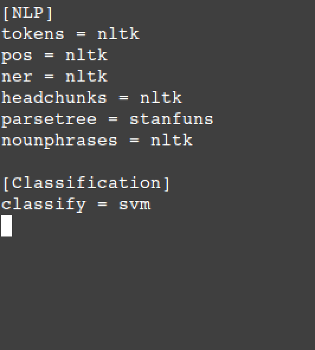
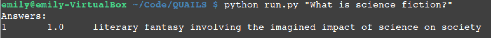

.. _ask:

=================
Asking a Question
=================

This section demonstrates how to configure Quails and ask a question.

Configuration
=============

 	Quails configuration file

Asking a Question
=================

From the main Quails directory (containing ``run.py``), ask your question following the usage guidelines:

:: python run.py <string containing a question>

Example usage is shown in the following figure.

	Quails sample question and answer 

Quails currently does not support batch processing of questions, but will be needed for experiments and so will be included in a subsequen iteration of the framework.
