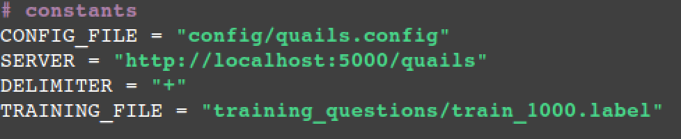
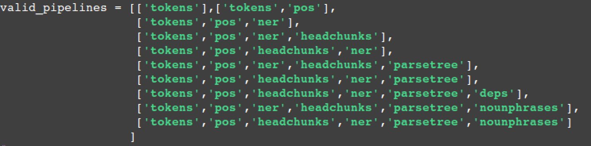
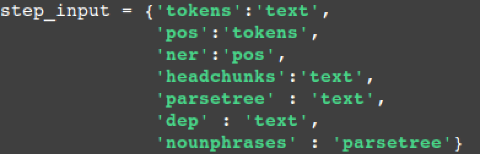
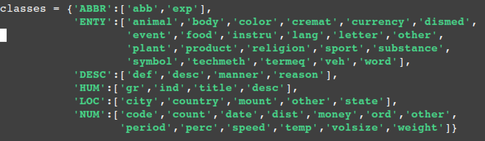
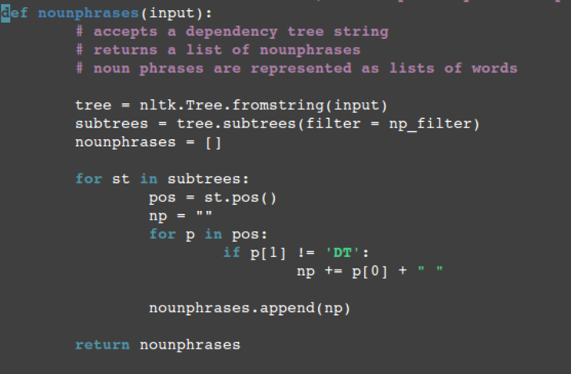
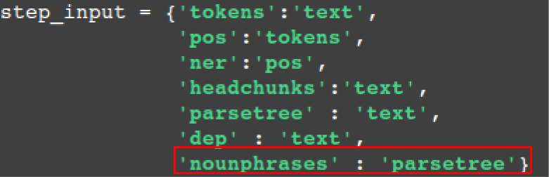
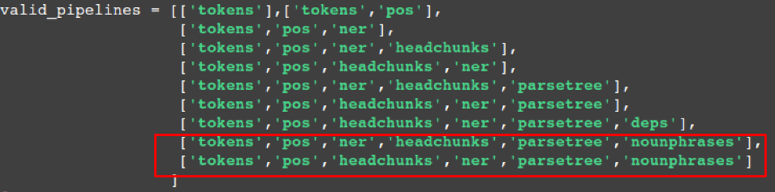
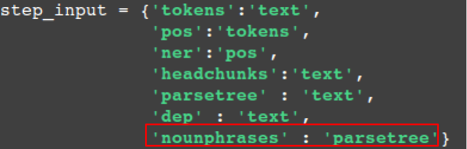

.. _custom:

==================
Customizing Quails
==================

This page contains two brief tutorials:

1. Understanding ``quails.py``.
2. How to add NLP services to the Quails server.

Understanding ``quails.py``
===========================

Quails Constants
----------------

Quails constants contain hardcoded paths and other static items that are depended on by the interface and the server.

NLP Data Structures
-------------------

In the configuration file ``config.py``, the order of the NLP steps determines their order in the NLP pipeline (see :ref:`Ask a Question<ask>`).  The structure ``valid_pipelines`` represents the list of valid NLP pipelines.  The server checks against this list when an NLP request comes in.  If the incoming pipeline is valid, the request is processed.  Otherwise, the server returns a failure message.  If you add a new function to ``nltkfuns.py`` or ``stanfuns.py``, you will need to create new pipeline objects that include your new service. This will be demonstrated in the second tutorial on this page.  Be careful to consider what type of input your function needs.  For example, in the second tutorial we will add a function to the server that extracts noun phrases from parse trees.  If we have not already generated a parse tree, then the noun phrases function will fail.

The ``step_input`` structure specifies the input type required by each of the available steps.  This is where we specify that the function ``nounphrases`` requires input type ``parsetree``.  Naming the input type after the function that generates it is an easy way to manage the dependencies.  Moreover, it is required in order for the server to feed the correct input to the current NLP step.  This is because when a step is run, say ``pos``, the results are stored in a dictionary entry called ``pos``.  Therefore, when we wish to use the named entity recognizer, ``ner``, we can feed it the result of the ``pos`` function.  This can be expressed as the following:

::

	# the server calls the function in a different manner...
	# this is an example of how we can use previous nlp results
	# in order to obtain new results
	ner(nlp_features['pos'])

Classification Data Structure
-----------------------------

Quails Objects
--------------

Question
^^^^^^^^

QuailsConfig
^^^^^^^^^^^^

How to add NLP Services to the Quails Server
============================================

In this tutorial, we will walk through the process of adding an NLTK function called "nounphrases" to the server.  The nounphrases function will return a list of nounphrases from the questions parse tree.

1.  Add the function to ``nltkfuns.py``

2.  Add the function name to the list of valid pipelines in ``quails.py``

3.  Add the input type to ``quails.py``

Currently, there is no way to streamline this process, but using this guide should make it fairly simple to introduce new NLP functionality to the system.  

Future versions will enable the user to add functionality to more components of the Quails system.
  

