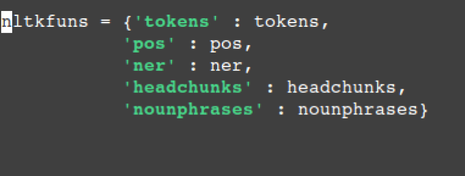

.. _custom:

==================
Customizing Quails
==================

This page contains two brief tutorials:

1. Understanding ``quails.py``.
2. How to add NLP services to the Quails server.

Understanding ``quails.py``
===========================

Quails Constants
----------------

.. figure:: images/QuailsConstants.png
	:align: center
	:scale: 50

NLP Data Structures
-------------------

.. figure:: images/QuailsValidPipelines.png
	:align: center

.. figure:: images/QuailsNLPInputTypes.png
	:align: center
	:scale: 50

Classification Data Structure
-----------------------------

Quails Objects
--------------

Question
^^^^^^^^

QuailsConfig
^^^^^^^^^^^^

How to add NLP Services to the Quails Server
============================================

In this tutorial, we will walk through the process of adding an NLTK function called "nounphrases" to the server.  The nounphrases function will return a list of nounphrases from the questions parse tree.

1.  Add the function to ``nltkfuns.py``

.. figure:: images/npnew.png
	:align: center

2.  Add the function name to the list of valid pipelines in ``quails.py``

.. figure:: images/nppipe.png
	:align: center

3.  Add the input type to ``quails.py``

.. figure:: images/npinput.png
	:align: center
	:scale: 50

Currently, there is no way to streamline this process, but using this guide should make it fairly simple to introduce new NLP functionality to the system.  

Future versions will enable the user to add functionality to more components of the Quails system.
  

