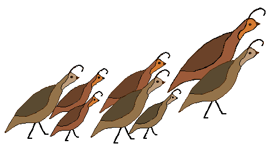

======
QUAils
======

.. QUAILS documentation master file, created by
   sphinx-quickstart on Tue Mar 15 17:33:22 2016.
   You can adapt this file completely to your liking, but it should at least
   contain the root `toctree` directive.

|
| QUAils Documentation
==================================
Welcome to the documentation pages for the QUAils Question Answering framework.  This project is meant to provide a basis for the research and implementation of a cognitive domain-specific question answering system. 

.. toctree::
   :maxdepth: 2

* :ref:`Introduction`
* :ref:`Architecture Overview`
* :ref:`Installation`
* :ref:`QUAils Objects`
* :ref:`Adding a new NLP service`
* :ref:`Next steps`
* :ref:`About`

| 

